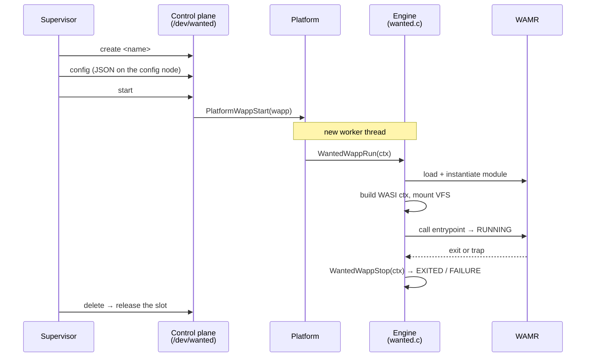
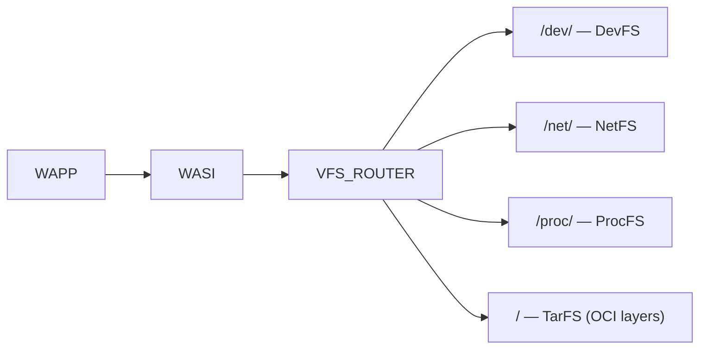
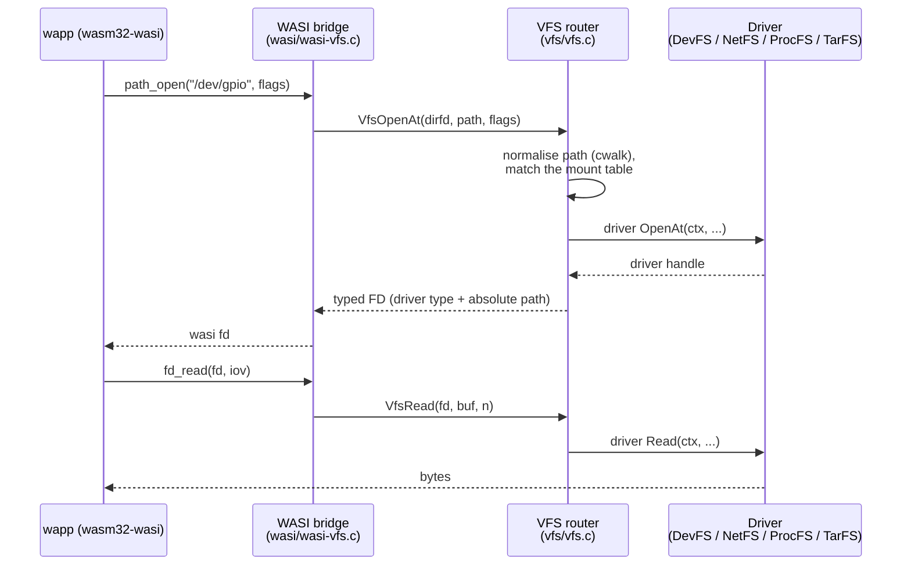

WANTED (_WebAssembly Nanocontainer Technology for Embedded Devices_) runs multiple WebAssembly applications — **wapps** — as isolated threads inside one process. A wapp's only interface to the outside world is a virtual filesystem: every device, socket, IPC channel, and control-plane node is a path. This page is the conceptual anchor; the reference pages drill into each surface.
This architecture was inspired by Plan 9 operating system design and tries to be compliant with POSIX specification, so that wapps can be easily portable.

## Wapp model

A wapp is an OCI-style layered TAR carrying at least an `app.wasm` (a `wasm32-wasi` binary); image identity (name + version) comes from the registry filename, not from any in-image metadata. It is isolated on two axes:

- **Memory** — WebAssembly linear memory. A wapp cannot address host memory or another wapp's memory; the runtime bounds every access.
- **I/O** — the host interface is the VFS only. There is no ambient filesystem, no shared memory between wapps, and no syscall a wapp can make that the VFS router does not mediate.

Each wapp runs on its own thread (thread-per-wapp), scheduled by the platform. Its lifecycle is `load → instantiate → run → stop/exit → unload`: the registry maps the image, WAMR instantiates the module, the engine wires the VFS and calls the entrypoint, and on exit or `stop` the thread is reaped and the image unmapped.

A wapp is written against a **POSIX environment**: it is an ordinary `wasm32-wasi` program calling `open`/`read`/`write`/`close`, `clock_gettime`, `sleep`, and the rest of the standard C library, which the toolchain lowers to WASI. Existing POSIX code ports with little change — the wapp does not know it is sandboxed; it only sees a filesystem that happens to be entirely virtual.

The full lifecycle, from a supervisor `create` to slot release, threading the control plane, the engine, and WAMR:

A `stop` drives the same teardown early via `WantedWappTerminate` (a cooperative abort), and a supervisor that exits is respawned; only an explicit `poweroff`/`reboot` ends the engine.

## VFS router

The router follows the **Plan 9** principle that *everything is a file*: hardware devices, network sockets, inter-wapp pipes, process state, and even the runtime control plane are not special syscalls — they are paths in the wapp's namespace, opened and read and written like any file. This is what makes the POSIX surface above sufficient to reach every capability, and what makes a wapp's access exactly equal to the set of paths its launch config mounts.

Path resolution is split into four independent namespaces, each backed by a driver:

- **`/dev/`** — device capability namespace; prefix-routes to registered sub-drivers (`null`, named pipes, stdio stubs, the `wanted` control plane, offload devices like `sha256`/`ed25519`/`inflate`, and any wapp-configured drivers).
- **`/net/`** — network namespace; the socket driver for TCP/UDP, plain and TLS.
- **`/proc/`** — read-only system state; privileged entries are hidden unless `system.privileged` is set.
- **`/`** — TarFS, the merged read-only OCI layer stack — the wapp's root filesystem.

A WASI call carries a path; the router normalises it (`cwk_path_normalize` via `cwalk` — collapsing `.`, `..`, double slashes, trailing slashes, and denying parent-traversal past root), consults the mount table to pick the namespace, and dispatches to the driver. Open files live in a per-wapp **typed FD table**: each entry records its driver type and the absolute path it was opened at, which is what makes relative resolution (`VfsOpenAt`) work. The four namespaces are routed independently, so a driver in one cannot shadow another.

The path a syscall takes from the wapp to a driver — `open` then `read`:

## Supervisor

The engine boots a single privileged wapp, the **supervisor**, before any other. It is an ordinary wapp with two differences: its thread runs one priority step above worker wapps, and its launch config grants it the `wanted` control-plane driver. It uses that grant to install, start, stop, and observe other wapps, and to drive the engine's power state.

The supervisor image is loaded at runtime via `PlatformWappLoad` — it is **not** compiled into the engine binary. Three variants ship under `wasm/supervisor/`:

| Variant | Path | Source | Purpose |
|---------|------|--------|---------|
| `sheriff` | `wasm/supervisor/sheriff/` | built from the `wapps/sheriff` submodule (Zig) | Production control-plane agent. |
| `wsh` | `wasm/supervisor/wsh/` | compiled from `wapps/wsh/` | Interactive debug shell for manual inspection. |
| `selftest` | `wasm/supervisor/selftest/` | compiled from `wapps/selftest/` | Orchestrates the in-WASM test suite. |

The image is selected by `supervisor.imagePath` in the config, falling back to the `WANTED_SUPERVISOR_IMAGE_PATH` build option. A supervisor that exits on its own is respawned; only an explicit `poweroff`/`reboot` ends the engine. The image is read once and kept mapped; `reload-supervisor` on the root `ctl` arms a re-read so a newly staged image is adopted at the next respawn, with child wapps running throughout. A staged image that cannot launch is rolled back to the compiled-in one.

## Platform abstraction

Everything OS-specific sits behind the `Platform*` seam (`platform/include/platform.h`): thread lifecycle (`PlatformWappStart`/`Stop`/`Loop`/`GetState`), file I/O and state dirs, sockets, clock and sleep, random, memory stats, mutexes, the registry backend, crypto offload (SHA-256, Ed25519 verify), the external-RAM (PSRAM) heap, A/B firmware OTA, and the power-state hooks. The engine core is platform-agnostic and links one implementation:

- **`platform/linux/`** — pthreads, a host-filesystem registry, `mallinfo2` memory stats, OpenSSL TLS and Ed25519, cooperative stop interrupted by `SIGUSR2`.
- **`platform/nuttx/`** — the NuttX port: the CI-gated simulator plus real boards (classic ESP32, RP2350); cooperative stop interrupted by `SIGUSR2`; vendored `orlp/ed25519` verify; no TLS.
- **`platform/esp-idf/`** — the native ESP-IDF port for the ESP32-S3: FreeRTOS via the pthread wrapper, a flash LittleFS registry, octal PSRAM, A/B OTA, mbedTLS sockets.
- **`platform/dummy/`** — an in-memory stub used by unit tests.

The [Platform Guide](platform-guide.md) covers each target and the porting checklist.

## WAMR runtime

The WebAssembly core is [WAMR](https://github.com/bytecodealliance/wasm-micro-runtime) 2.4.4 in **classic interpreter** mode (`WAMR_BUILD_INTERP=1`, `WAMR_BUILD_FAST_INTERP=0`, no AOT/JIT) — no per-target code generation, which is what lets the same engine and the same wapps run on Linux and a microcontroller-class RTOS. Per wapp, the engine loads the pre-fetched module, instantiates it, creates an execution environment, and registers the native symbols: the WASI `snapshot_preview1` bridge (routed to the VFS). Native registration is global-once; each wapp gets its own instance, execution environment, and thread.

## Boot sequence

1. `WantedStart(config)` parses `system.privileged` and the `supervisor` block.
2. The supervisor image is loaded and its TAR layers indexed (TarFS).
3. The supervisor wapp is instantiated; the engine mounts `/`, `/dev`, `/net`, `/proc`, registers the built-in devices, applies the configured console, drivers, mounts, and sockets, and registers the WASI + WANTED natives.
4. Control transfers to the supervisor's entrypoint. It reads the registry and drives the control plane to launch further wapps.
5. The run loop blocks until an explicit `poweroff`/`reboot`.

## See also

- [VFS Reference](vfs-reference.md) — every mountpoint and driver.
- [Control Plane Reference](control-plane-reference.md) — the `/dev/wanted` contract.
- [Platform Guide](platform-guide.md) — Linux, NuttX, and porting.
