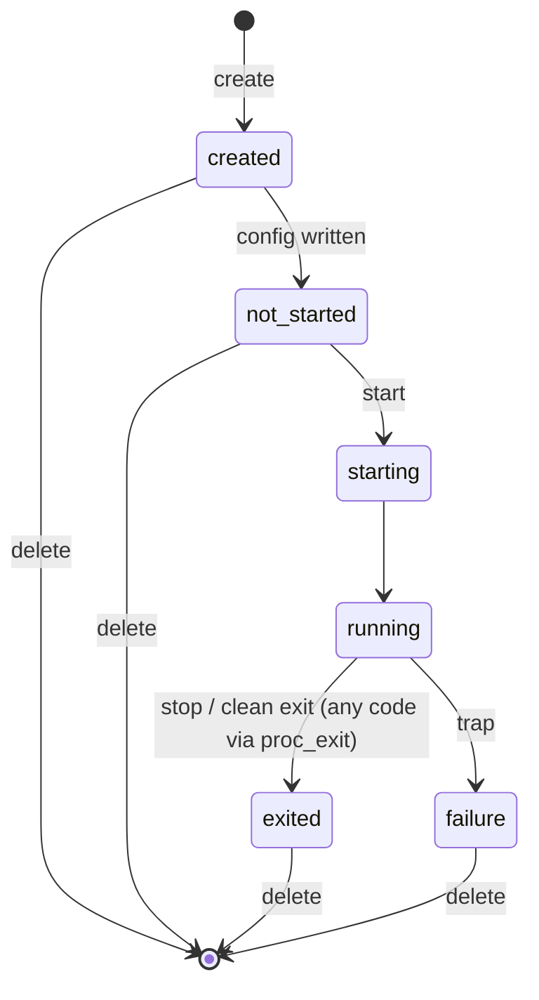

The control plane is the VFS namespace a supervisor uses to install, launch, observe, and stop wapps, and to drive the engine's own power state. It is usually mounted at `/dev/wanted` (depnds on mount path in config; in default its `/dev/wanted`) and is a privileged capability: a wapp reaches it only if its launch config grants the `wanted` driver. An ordinary wapp has no path to it.

Every interaction is an ordinary file operation. Identity travels in the path — never in a payload field — so reads compose as plain text and only the launch config is JSON.

This reference documents the **engine-provided contract** — the nodes, verbs, and semantics the engine guarantees. How a supervisor *drives* that contract (reconciliation cadence, capability policy, retry and back-off) is supervisor behaviour and is out of scope here.

## Mounting and access

A supervisor is granted the namespace by a `drivers[]` entry in its launch config:

```json
{ "name": "wanted" }
```

The `wanted` driver is a device singleton: it mounts at its canonical `/dev/wanted` derived from the name.

## Namespace map

```
/dev/wanted/
  ctl                       root verbs: "create <name>" | "delete <name>"
                            | "poweroff" | "reboot"
  wapps/                    enumerable directory — one entry per known instance
    <name>/                 <name> is the instance name (set by create)
      ctl       (w)         per-wapp verb: "start [<image>]" | "stop"
      state     (r)         lifecycle token
      image     (r)         registry image the instance runs
      version   (r)         image version tag (opaque string)
      id        (r)         engine-assigned wapp id
      exit_code (r)         WASI exit code (authoritative when state == exited)
      log       (r)         buffered stdout/stderr (when console: log)
      config    (w)         JSON launch config, consumed by the next start
  reg/                      installed-wapp registry directory
  config                    supervisor bootstrap meta-config
```

## Root nodes

| Path | Access | Description |
|------|--------|-------------|
| `/dev/wanted/ctl` | w | Root verbs. `create <name>` registers a wapp's control namespace ahead of configuring it. `delete <name>` releases a slot — a `create` reservation or a terminal (`exited`/`failure`) wapp — so the name leaves `wapps/` and its nodes return `-ENOENT` again. `poweroff` stops the engine without respawning the supervisor. `reboot` restarts the engine (host re-exec / board reset). |
| `/dev/wanted/reg` | rw | Installed-wapp registry. `readdir` enumerates `name:version` entries; reading an entry returns a small JSON descriptor (`name`/`version`/`size`) synthesized from the registry — no image load. **Install by ref**: open `reg/<name>:<version>` for *write* and stream the OCI TAR; the path names the stored image. The version is an opaque tag; each ref component must match `[A-Za-z0-9_][A-Za-z0-9._-]*` or the open is rejected. A plain read of the directory itself returns `-EISDIR`. |
| `/dev/wanted/config` | r | Supervisor bootstrap meta-config. |

The root `ctl` accepts **only** `create <name>`, `delete <name>`, `poweroff`, and `reboot`; any other token returns `-EINVAL`. The root ctl does **not** launch wapps — `start` and `stop` exist only per-wapp (`wapps/<name>/ctl`). `poweroff` and `reboot` take no argument and are the only writes that end the engine's run loop: a supervisor that exits on its own is respawned.

### Releasing a slot (`delete`)

`delete <name>` is the inverse of `create`: it removes the name from the control plane so `wapps/<name>/` stops enumerating and every node under it returns `-ENOENT` again.

```
write /dev/wanted/ctl delete app1
```

It frees a `create` reservation (`created`/`not_started`) and/or a terminal platform slot (`exited`/`failure`). The slot allocator already reuses a terminal slot on the next `start`, so `delete` is for explicitly reclaiming a name — releasing the `wapps/` entry and any buffered config — without launching another wapp.

| Target state | Result |
|--------------|--------|
| `created` / `not_started` | Reservation freed; name → `-ENOENT`. |
| `exited` / `failure` | Terminal slot released; name → `-ENOENT`. |
| `running` / `starting` | Rejected with `-EBUSY` — stop the wapp first; there is no implicit stop-then-delete. |
| unknown name | `-ENOENT`. |

### First-start lifecycle

A wapp is launched in three deliberate steps — identity always in the path, configuration always JSON on its own node, and the launch verb on the wapp's own ctl:

```
write /dev/wanted/ctl              create app1             # register the namespace
write /dev/wanted/wapps/app1/config { ...JSON config... }  # buffer the launch config
write /dev/wanted/wapps/app1/ctl   start                   # launch with that config
```

`create` is the **only** way to bring a wapp's namespace into being: it reserves `wapps/app1/` (which then enumerates and reads `state == created`), and only then are that wapp's `config`, `ctl`, and read nodes openable. The subsequent `config` write targets the reservation (moving it to `not_started`), and the per-wapp `start` consumes it. A bare `created` wapp cannot `start` — its `config` must be written first. There is no config-without-create: opening any node of a name the engine doesn't know returns `-ENOENT`, so a name cannot be probed or configured by guessing its path.

Command-line arguments (`argv[1..]`) and environment variables travel in the `config` node's `args[]` and `envs[]` arrays (see the schema below) — there is no inline-argument shorthand on the control plane. `argv[0]` is always the instance name, set by the engine.

**Instance vs. image.** `create <name>` reserves an *instance* name; the *image* it runs is resolved at `start` in priority order: an explicit `start <image>` argument, else the config's `image` field, else the instance name. So one image can back several instances (different `<name>`s, same image), and a bare `create` can go straight to `start <image>` — the explicit image satisfies the start gate without a prior `config` write (the wapp launches on default console/args). A bare `start` on an unconfigured reservation is still rejected.

## Wapp namespace

`readdir` on `wapps/` enumerates every wapp the engine knows — live ones plus `create`d reservations. A wapp's directory and the nodes below it exist **only** for such a known name; opening `wapps/<unknown>/<anything>` returns `-ENOENT`. Each `wapps/<name>/` exposes:

| Node | Access | Content / Verb |
|------|--------|----------------|
| `state` | r | Lifecycle token: `created`, `not_started`, `starting`, `running`, `exited`, `failure`. A bare `create` reservation (no config yet) reads `created`; once its `config` is written it reads `not_started`. |
| `image` | r | The registry image the instance runs, known once it is live (the loader stamps it). A `created`/`not_started` reservation has not bound an image yet and reads empty. |
| `version` | r | The image's version tag — an opaque string (e.g. `0.0.1-1`, `stable`, a digest), from its registry entry. |
| `id` | r | Engine-assigned wapp id (decimal). |
| `exit_code` | r | The wapp's WASI exit code as a decimal integer. **Authoritative only when `state == exited`**; otherwise (running, or a trap that set `state == failure`) it reads the sentinel `-1`. Lets a supervisor distinguish a clean zero exit, a clean non-zero (application-level) exit, and a trap. |
| `log` | r | Ring-buffered stdout/stderr, present when the wapp was launched with a `log` console. |
| `ctl` | w | `start [<image>]` launches the instance (optional explicit image overrides `config.image`); `stop` terminates it. The instance name comes from the path. |
| `config` | w | JSON launch config (see below). Buffered and consumed by the next `start` for this name, then cleared. |

A read node returns its value once; the next read on the same fd returns `0` (EOF), and the value regenerates on a fresh open. A control write that overflows the fixed line buffer is rejected with `-EMSGSIZE`.

### Verbs

A verb is one `write()` to the node. The engine has no shell or I/O redirection; the examples below use the `wsh` debug shell's `write` builtin, which opens the path and writes the joined tokens verbatim:

```
write /dev/wanted/wapps/app1/ctl start          # launch app1 (uses its buffered config, if any)
write /dev/wanted/wapps/app1/ctl start duplex    # launch app1 from the "duplex" image
write /dev/wanted/wapps/app1/ctl stop            # terminate app1
```

- `start [<image>]`: resolve the image (explicit argument → `config.image` → the instance name) in the registry → load the OCI layers → install the buffered config's console, drivers, mounts, sockets, args, and envs → start the wapp. Image identity (name + version) is read from the registry entry; the instance keeps its own name. Returns bytes written, or a negative errno if any step fails.
- `stop`: terminate the wapp named by the path. Returns bytes written / negative errno.

The engine declares no capability requirements in the image and enforces none; a wapp's effective capabilities are exactly the consoles, drivers, mounts, and sockets its launch config grants. Validating those against policy before issuing `start` is the supervisor's responsibility. The engine trusts the config it is handed.

## Wapp state machine



`delete` is the only edge back to `[*]` from `created`/`not_started`; a terminal `exited`/`failure` slot also leaves via `delete` (or is silently reused by the next `start`). A `running`/`starting` wapp has no `delete` edge — stop it first.

`state` is the authoritative observed status. A supervisor maps these tokens onto its own reconciliation state machine; `starting` and `stopping` are supervisor-side transient states, not engine tokens.

| Engine `state` | Meaning |
|----------------|---------|
| `created` | Namespace reserved via `create` but **no config written yet** — the bare reservation. A `created` wapp cannot `start`; its `config` must be written first. |
| `not_started` | A configured reservation, ready to start: `config` has been written but the wapp has not been launched. (A name the engine doesn't know has no namespace at all — its nodes return `-ENOENT` rather than a state token.) |
| `starting` | Launch issued, instantiation in progress. |
| `running` | Executing. |
| `exited` | Terminated cleanly — `stop`, or a `proc_exit`/return from the wapp. The exit code (zero **or** non-zero) is on the `exit_code` node. |
| `failure` | Terminated by a trap (illegal instruction, OOB access, `unreachable`) — no WASI exit code exists; `exit_code` reads the sentinel. |

## Launch-config schema

A wapp that needs a console, drivers, mounts, or sockets has its config written as one JSON object to `wapps/<name>/config` before `start`. The config carries no name — identity is the path.

```json
{
  "image": "app",
  "console": {
    "in":  { "name": "null" },
    "out": { "name": "log" },
    "err": { "name": "log" }
  },
  "drivers": [
    { "name": "gpio" }
  ],
  "mounts": [
    { "name": "platform", "path": "/var/lib/app" },
    { "name": "config",   "path": "/etc/config", "options": "{\"config_file\":\"/config.json\"}" }
  ],
  "sockets": [
    { "name": "uplink", "address": "tcp://127.0.0.1:8888" }
  ],
  "args": ["--port", "8888"],
  "envs": ["TZ=UTC", "LOG_LEVEL=info"]
}
```

| Field | Type | Notes |
|-------|------|-------|
| `image` | string | **Optional** registry image this instance runs, as a reference `<name>[:<tag>]` — a bare name resolves to the first match, a pinned tag (`duplex:stable`) resolves exactly. When omitted it defaults to the instance name, so a single-instance wapp needs no `image`. Set it to run several instances off one image, or override it per launch with `start <image>`. |
| `console` | object | Slots `in` / `out` / `err`, each a driver spec backing the wapp's stdio. **Optional**: an unset slot defaults — `in` to `null`, `out`/`err` to `log` — so a wapp launches without an explicit console and its output is captured to the `log` node. Override a slot with `log` (capture), `null` (discard), or `platform` (redirect to the engine's native stdio, fds 0/1/2). The `platform` *name* backs stdio here; in `mounts[]` it is instead a host directory. |
| `drivers` | array | Up to 10 device singletons. Each mounts at `/dev/<name>` derived from the name; a `path` is rejected. |
| `mounts` | array | Up to 10 file/backend drivers, each bound at an arbitrary absolute `path` outside `/dev` and `/net`. The `platform` backend binds a host directory as a native WASI preopen (a bind mount; `options` set the host source and access mode — see below); other backends mount through the VFS router. |
| `sockets` | array | Up to 10 named connections. Each is created at `/net/<name>`; the transport is the entry's `address`. A `path` is rejected. |
| `args` | array | Up to 8 strings (≤63 chars each), the wapp's `argv[1..]`. `argv[0]` is always the instance name, set by the engine. |
| `envs` | array | Up to 8 POSIX `KEY=VALUE` strings (≤63 chars each), the wapp's `environ`. |

Entry shapes per section:

| Section | Keys | Notes |
|---------|------|-------|
| `console.*` | `name`, `options` | `name` is one of `null`, `log`, `platform`. |
| `drivers[]` | `name`, `options` | `name` is a device driver (e.g. `null`, `wanted`); mounted at `/dev/<name>`. |
| `mounts[]` | `name`, `path`, `options` | `name` is a file/backend driver (`platform`, `config`, `9p`); `path` is required, absolute, and outside `/dev`/`/net`. |
| `sockets[]` | `name`, `address` | `name` is the `/net` node label; `address` is a URL `<scheme>://<host>:<port>` with scheme `tcp`/`udp`/`tcps`/`udps`. |

A `platform` mount is a bind mount; its `options` accept two comma-separated knobs: `src=<abshostpath>` (the host directory backing the mount — defaults to `path`) and `ro`/`rw` (access mode — defaults to `rw`). A `ro` mount denies every write (`-EROFS`) and requires the host directory to already exist; `path` stays the wapp-visible mount point. A relative/empty `src` or an unrecognised token is rejected at install. Example: `{ "name": "platform", "path": "/cfg", "options": "src=/etc/app,ro" }`.

The parser uses a bounded token pool and a 2048-byte stack buffer; an oversized config returns `-EMSGSIZE`.

## Driving it from wsh

The `wsh` debug supervisor wraps the raw node operations as builtins:

| Command | Effect |
|---------|--------|
| `status` | List every wapp under `wapps/` with its state. |
| `status <name>` | Print one wapp's `state`, `version`, and `id`. |
| `create <name>` | Write `create <name>` to the root `ctl` to reserve the namespace. |
| `delete <name>` | Write `delete <name>` to the root `ctl` to release the slot (stop a running wapp first). |
| `set_config <name> <json>` | Write the JSON launch config to `wapps/<name>/config`. |
| `start <name>` | Write `start` to `wapps/<name>/ctl` (launches with the buffered config; the image comes from `config.image`, defaulting to `<name>`). |
| `stop <name>` | Write `stop` to `wapps/<name>/ctl`. |
| `poweroff` / `reboot` | Drain child wapps, then write the verb to the root `ctl`. |

The filesystem builtins (`ls`, `cat`, `write`) operate on any node directly — e.g. `cat /dev/wanted/wapps/app1/log` or `ls /dev/wanted/wapps`.

## See also

- [Quick Start](quickstart.md) — a worked launch from the `wsh` shell.
- [Configuration Reference](configuration-reference.md) — the engine-level config that boots the supervisor.
- [VFS Reference](vfs-reference.md) — every other namespace a wapp can see.
