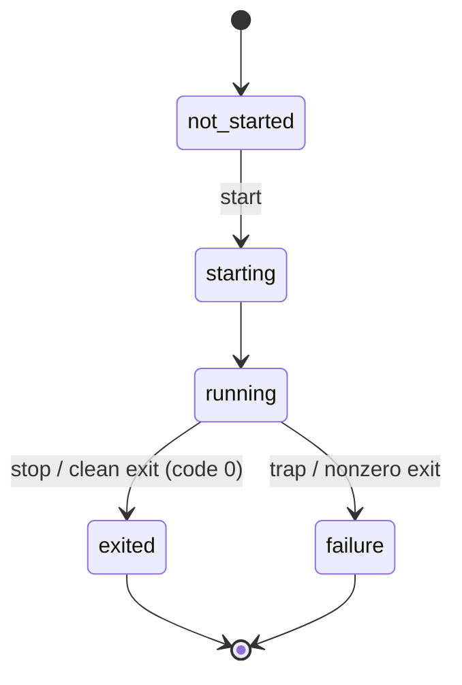

The control plane is the VFS namespace a supervisor uses to install, launch, observe, and stop wapps, and to drive the engine's own power state. It is mounted at `/dev/wanted` and is a privileged capability: a wapp reaches it only if its launch config grants the `wanted` driver. An ordinary wapp has no path to it.

Every interaction is an ordinary file operation. Identity travels in the path — never in a payload field — so reads compose as plain text and only the launch config is JSON.

This reference documents the **engine-provided contract** — the nodes, verbs, and semantics the engine guarantees. How a supervisor *drives* that contract (reconciliation cadence, capability policy, retry and back-off) is supervisor behaviour and is out of scope here.

## Mounting and access

A supervisor is granted the namespace by a `drivers[]` entry in its launch config:

```json
{ "name": "wanted", "path": "/dev/wanted" }
```

`/dev/wanted` is the canonical mount point; a wapp granted the driver at a different path sees the same tree under that prefix.

## Namespace map

```
/dev/wanted/
  ctl                       root verbs: "start <name>" | "poweroff" | "reboot"
  wapps/                    enumerable directory — one entry per known wapp
    <name>/
      ctl       (w)         per-wapp verb: "start" | "stop"
      state     (r)         lifecycle token
      version   (r)         "MAJOR.MINOR.PATCH-PACKAGE"
      id        (r)         engine-assigned wapp id
      log       (r)         buffered stdout/stderr (when console: log)
      config    (w)         JSON launch config, consumed by the next start
  reg/                      installed-wapp registry directory
  config                    supervisor bootstrap meta-config
```

## Root nodes

| Path | Access | Description |
|------|--------|-------------|
| `/dev/wanted/ctl` | w | Root verbs. `start <name>` resolves the name in the registry, applies any buffered config, and launches it. `poweroff` stops the engine without respawning the supervisor. `reboot` restarts the engine (host re-exec / board reset). |
| `/dev/wanted/reg` | rw | Installed-wapp registry. `readdir` enumerates `name:version` entries; writing a wapp OCI TAR installs it. A plain file-read returns `-EISDIR`. |
| `/dev/wanted/config` | r | Supervisor bootstrap meta-config. |

The root `ctl` accepts **only** `start <name>`, `poweroff`, and `reboot`; any other token returns `-EINVAL`. There is no root `stop` — `stop` exists only per-wapp. `poweroff` and `reboot` take no argument and are the only writes that end the engine's run loop: a supervisor that exits on its own is respawned.

The `start` verb carries **only** the wapp name — there is no inline config payload, including on a wapp's first start. A launch config takes effect only if it was previously buffered at that wapp's `config` node (see below); otherwise the wapp launches with no config.

## Wapp namespace

Live wapps are discovered by `readdir` on `wapps/`. Each `wapps/<name>/` exposes:

| Node | Access | Content / Verb |
|------|--------|----------------|
| `state` | r | Lifecycle token: `not_started`, `starting`, `running`, `exited`, `failure`. A name with no runtime slot reads `not_started`. |
| `version` | r | `MAJOR.MINOR.PATCH-PACKAGE`, e.g. `0.0.1-1`. |
| `id` | r | Engine-assigned wapp id (decimal). |
| `log` | r | Ring-buffered stdout/stderr, present when the wapp was launched with a `log` console. |
| `ctl` | w | `start` launches the wapp; `stop` terminates it. The name comes from the path. |
| `config` | w | JSON launch config (see below). Buffered and consumed by the next `start` for this name, then cleared. |

A read node returns its value once; the next read on the same fd returns `0` (EOF), and the value regenerates on a fresh open. A control write that overflows the fixed line buffer is rejected with `-EMSGSIZE`.

### Verbs

A verb is one `write()` to the node. The engine has no shell or I/O redirection; the examples below use the `wsh` debug shell's `write` builtin, which opens the path and writes the joined tokens verbatim:

```
write /dev/wanted/wapps/app1/ctl start      # launch app1 (uses its buffered config, if any)
write /dev/wanted/wapps/app1/ctl stop       # terminate app1
write /dev/wanted/ctl start app1            # create-and-launch shorthand for a not-yet-present wapp
```

- `start`: resolve the name in the registry → load the OCI layers → parse the manifest → install the buffered config's drivers, console, and preopens → start the wapp. Returns bytes written, or a negative errno if any step fails.
- `stop`: terminate the wapp named by the path. Returns bytes written / negative errno.

The engine does **not** enforce a wapp's manifest `requirements[]`; validating capabilities against policy before issuing `start` is the supervisor's responsibility. The engine trusts the `drivers[]` it is handed.

## Wapp state machine



`state` is the authoritative observed status. A supervisor maps these tokens onto its own reconciliation state machine; `starting` and `stopping` are supervisor-side transient states, not engine tokens.

| Engine `state` | Meaning |
|----------------|---------|
| `not_started` | Known name with no live runtime slot. |
| `starting` | Launch issued, instantiation in progress. |
| `running` | Executing. |
| `exited` | Terminated with exit code `0` (clean exit or `stop`). |
| `failure` | Terminated abnormally — a trap, or a nonzero exit code. |

## Launch-config schema

A wapp that needs drivers, console redirection, or preopens has its config written as one JSON object to `wapps/<name>/config` before `start`. The config carries no name — identity is the path.

```json
{
  "console": {
    "in":  { "name": "null" },
    "out": { "name": "log" },
    "err": { "name": "log" }
  },
  "drivers": [
    { "name": "socket", "path": "/net/s", "options": "t 127.0.0.1 8888" }
  ],
  "preopens": ["/var/lib/app"]
}
```

| Field | Type | Notes |
|-------|------|-------|
| `console` | object | Slots `in` / `out` / `err`, each a driver spec backing the wapp's stdio. **Optional**: an unset slot defaults — `in` to `null`, `out`/`err` to `log` — so a wapp launches without an explicit console and its output is captured to the `log` node. Override a slot with `log` (capture), `null` (discard), or `platform` (redirect to the engine's native stdio, fds 0/1/2). The `platform` *name* backs stdio here, but mounted at a path in `drivers[]` it is instead the host filesystem. |
| `drivers` | array | Up to 10 entries. VFS drivers mounted into the wapp's namespace. |
| `preopens` | array | Up to 4 absolute paths (must start with `/`, ≤63 chars). The engine creates/opens each and binds it as a WASI preopen — the wapp's read-write state storage. |

Each driver spec (used by `console.*` slots and `drivers[]` entries):

| Key | Type | Notes |
|-----|------|-------|
| `name` | string | One of `null`, `log`, `9p`, `config`, `platform`, `socket`, `virt`, `wanted`. |
| `path` | string | Mount point inside the wapp namespace. Must resolve under `/dev/*` or `/net/*`, or name a console slot, else the driver is rejected at install. |
| `options` | string | Driver-specific. For `socket`: `t host port` (TCP), `u host port` (UDP), `T host port` (TLS TCP), `U host port` (TLS UDP). |

The parser uses a bounded token pool and a 2048-byte stack buffer; an oversized config returns `-EMSGSIZE`.

## Driving it from wsh

The `wsh` debug supervisor wraps the raw node operations as builtins:

| Command | Effect |
|---------|--------|
| `status` | List every wapp under `wapps/` with its state. |
| `status <name>` | Print one wapp's `state`, `version`, and `id`. |
| `start <name>` | Write `start <name>` to the root `ctl`. |
| `stop <name>` | Write `stop` to `wapps/<name>/ctl`. |
| `poweroff` / `reboot` | Drain child wapps, then write the verb to the root `ctl`. |

The filesystem builtins (`ls`, `cat`, `write`) operate on any node directly — e.g. `cat /dev/wanted/wapps/app1/log` or `ls /dev/wanted/wapps`.

## See also

- [Quick Start](quickstart.md) — a worked launch from the `wsh` shell.
- [Configuration Reference](configuration-reference.md) — the engine-level config that boots the supervisor.
- [VFS Reference](vfs-reference.md) — every other namespace a wapp can see.
