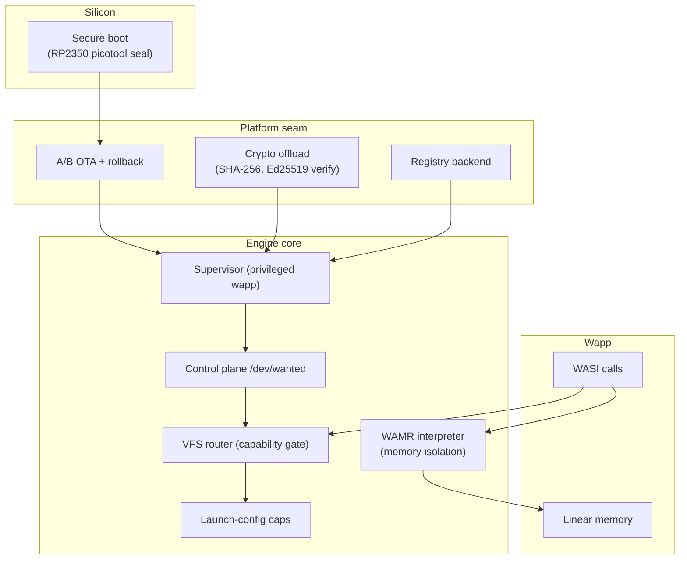
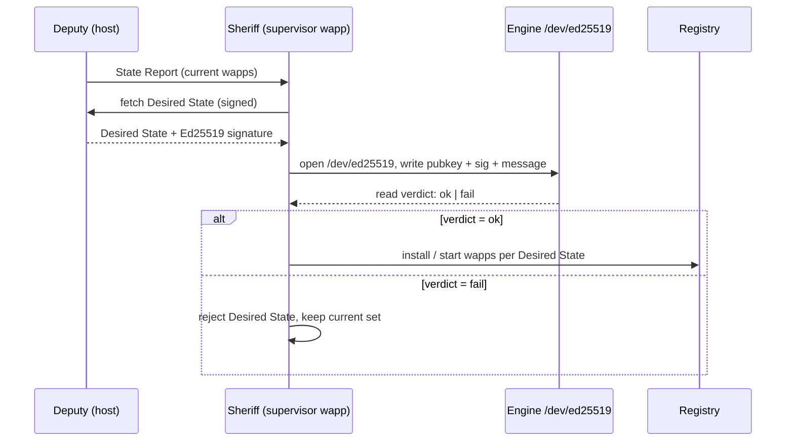
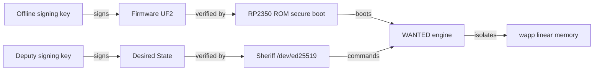

WANTED is a single-process WebAssembly runtime that runs untrusted code on a microcontroller. Security is **defense in depth**: each layer narrows what an attacker who controls the layer above can do, and no single layer is trusted to stand alone. This page walks the stack from the silicon up to the wapp, states what each layer assumes and what it guarantees, and is the conceptual companion to the [Architecture](architecture.md) and [Platform Guide](platform-guide.md) pages.

## Threat model

The assets are: the firmware image, the wapp images in the registry, the control-plane decisions (which wapp runs, with which config), and the secrets a wapp is granted (volume contents, socket credentials). The adversaries are: a network attacker who can reach the control-plane transport; a malicious or compromised wapp; and a physical attacker with the device in hand.

The engine does **not** defend against an attacker who has compromised the host build pipeline, the signing key, or the platform seam itself — those are out of scope and are assumed trusted. It also does not yet provide confidentiality at rest: registry images and volumes are stored unencrypted, and the control-plane transport on NuttX is plain TCP or serial (no TLS). The signed-workload path is an *integrity* guarantee, not a confidentiality one.

## Layers

The layers below are ordered from the most-trusted (silicon) to the least-trusted (the wapp). Trust flows down: a layer may rely on the guarantees of any layer above it, but never on one below.

### 1. Secure boot (RP2350)

The reference embedded target is the RP2350 (ARM Cortex-M33). Firmware authenticity at boot is established offline with the RP2350's built-in secure-boot flow:

- The firmware UF2 is sealed with `picotool seal --sign` (`make rp2350-sign`), which embeds a signed hash the ROM verifies before handing control to the application. The signing key is held offline; the device carries only the public half.
- The one-way OTP `SECURE_BOOT_ENABLE` fuse is **deliberately never burned**. Sealing is validated end-to-end, but the device remains reflashable over BOOTSEL/SWD for recovery and development. Burning the fuse would make a bricked device unrecoverable, so the project treats secure boot as a verified capability rather than a locked-down deployment.

What this layer guarantees: a sealed image cannot be silently replaced with an attacker image — the ROM rejects a signature mismatch. What it does not: it does not protect the running system from a later compromise, and on a development board without the fuse burned an operator can still reflash. Secure boot is the **root of trust** for everything above it; without it, the chain is only as trustworthy as whoever holds the SWD probe.

### 2. Device identity and key custody

A device needs a stable, verifiable identity so a control-plane peer (the **Deputy**) can decide which Desired State applies to it. WANTED does not bake a per-device key into firmware. Instead:

- The **Ed25519** key pair is the unit of device identity. The public key is what the Deputy trusts; the private key never enters the engine's memory in the verified path — the engine only runs `PlatformEd25519Verify`, which is verify-only.
- The engine holds **no keys**. The `/dev/ed25519` device takes the public key, signature, and message from the wapp that opened it (see [VFS Reference → ed25519](vfs-reference.md#ed25519--signature-verification-device)). Key custody stays with the caller; the engine is a curve-math oracle.
- The crypto backend is platform-specific: OpenSSL on Linux, the vendored `orlp/ed25519` (verify-only) on NuttX/RP2350, and a dummy stub on the ESP-IDF port (Ed25519 not yet ported there). The seam symbol is the one allowed to report `-ENOSYS`, which the `/dev/ed25519` verdict read surfaces to the wapp — so a build without a real backend fails closed rather than silently passing.

What this layer guarantees: a wapp can verify a signature without ever holding the verifying key material in its own linear memory, and a build without a crypto backend cannot pretend to verify. What it does not: it does not provision keys, rotate them, or attest to the Deputy — that is the supervisor's job.

### 3. Signed desired-state reconciliation (Sheriff)

The production supervisor is **Sheriff**, a privileged wapp that reconciles the device's running wapp set against a Desired State fetched from a Deputy. The integrity of that loop is the system's central security property:

- The Desired State is a signed message: the Deputy signs it with its Ed25519 private key, Sheriff verifies it with the public key it trusts before acting on it. A wrongly-signed Desired State is **rejected** — the running wapp set is left untouched rather than replaced.
- Verification goes through `/dev/ed25519`, so the public key, signature, and message all live in Sheriff's linear memory and the curve arithmetic runs in engine memory. Sheriff is itself a wapp, so it is memory-isolated from the engine like any other — the only thing that distinguishes it is the `wanted` driver grant in its launch config.
- The transport is **not** the integrity boundary. On the RP2350 with the CYW43439 radio the manager socket is `tcp://`; on a board without the radio it is `serial://` over USB-CDC. NuttX has no TLS, so the wire is plaintext — the signature is what makes the reconcile trustworthy, not the transport. (On Linux the same loop runs over `tcps://` with OpenSSL, but the signature check is still the load-bearing step.)
- This is the ecosystem's first genuine (not demo-stubbed) signed-workload verification on embedded hardware: the full loop — State Report uplink → Ed25519-verified signed Desired State → wapp `RUNNING` — is hardware-verified on the Feather RP2350, and a wrongly-signed Desired State is rejected.

What this layer guarantees: a network attacker who can tamper with the control-plane transport cannot inject a malicious Desired State — without the signing key the signature fails and Sheriff holds. What it does not: it does not authenticate the *transport* (an attacker can still read the wire on NuttX), and it trusts the Deputy's signing key not to be compromised.

### 4. Supervisor privilege and the control plane

The engine boots exactly one privileged wapp — the supervisor — before any other. Privilege is **not** a property of the binary; it is a property of the launch config: the supervisor's `params.drivers[]` includes `{"name": "wanted"}`, which mounts the `/dev/wanted` control plane. An ordinary wapp that lacks that grant has no path to the control plane — opening any `/dev/wanted/...` node returns `-ENOENT` for it.

The control plane is the only way to `create`/`start`/`stop`/`delete` wapps and to drive `poweroff`/`reboot`. Its contract is documented in the [Control Plane Reference](control-plane-reference.md). Two properties matter for security:

- **Identity travels in the path, never in a payload.** A `create app1` writes the instance name into the path (`/dev/wanted/wapps/app1/...`); the config JSON carries no name. A name the engine doesn't know has no namespace at all — its nodes return `-ENOENT`, so a wapp cannot probe or configure a peer by guessing its path.
- **The engine trusts the config it is handed.** A wapp's effective capabilities are exactly the consoles, drivers, mounts, and sockets its launch config grants — the image declares nothing. Validating those against policy before issuing `start` is the supervisor's responsibility. This is the seam where Sheriff's signature check matters: the Desired State *is* the set of launch configs, so signing it is signing the capability grants.

What this layer guarantees: only the supervisor can command the fleet, and a wapp cannot escalate its own capabilities — it cannot reach `/dev/wanted` without the grant, and it cannot rewrite its own config (the `config` node is consumed by the next `start` and cleared). What it does not: a compromised supervisor is game over — it is the trusted intermediary, and the engine does not second-guess it.

### 5. WASM memory isolation

Every wapp runs in its own WebAssembly linear memory, instantiated by WAMR 2.4.4 in **classic interpreter** mode (`WAMR_BUILD_INTERP=1`, `WAMR_BUILD_FAST_INTERP=0`, no AOT/JIT). The interpreter is the load-bearing isolation primitive:

- **No host memory access.** A wapp can only address its own linear memory; every memory access is bounds-checked by the interpreter. There is no pointer to host memory, to another wapp's memory, or to the engine's own structures — the linear-memory boundary is enforced by WAMR, not by the OS.
- **No code generation.** Classic interpreter mode means no JIT, no AOT, no per-target code patching. The same engine and the same wapps run on Linux and on a Cortex-M33 without a recompile, and there is no writable+executable memory window for a wapp to exploit.
- **No ambient syscalls.** The only host interface is the WASI `snapshot_preview1` bridge, and the bridge routes every call through the VFS router. There is no syscall a wapp can make that the router does not mediate — no shared memory, no ambient filesystem, no direct device access.
- **Compile-time memory caps.** Per-instance limits are Kconfig symbols: `CONFIG_WANTED_WASM_STACK_SIZE`, `CONFIG_WANTED_WASM_HEAP_SIZE`, `CONFIG_WANTED_WASM_MAX_MEMORY_PAGES`. The cap is enforced two ways — WAMR bounds `memory.grow` at runtime, and the engine refuses at load any image whose declared *initial* memory exceeds the cap (otherwise WAMR clamps the cap up to the module's initial, letting a large initial bypass the runtime bound). `just memcap` is the negative test that verifies the cap actually bounds a `memory.grow`.

What this layer guarantees: a wapp cannot escape its linear memory, cannot execute non-wasm code, and cannot reach the host except through the VFS. What it does not: it does not defend against a bug in WAMR itself — the interpreter is trusted, and a WAMR vulnerability is treated as an engine vulnerability.

### 6. VFS as the capability gate

The VFS router is the **only** I/O path, and it doubles as the capability system. A wapp sees exactly the paths its launch config mounts; everything else is absent. This is the Plan 9 principle — *everything is a file* — turned into an access-control boundary:

- The four namespaces (`/dev/`, `/net/`, `/proc/`, `/` TarFS) are routed independently; a driver in one cannot shadow another.
- Path normalisation (via `cwalk`) collapses `.`, `..`, double slashes, and trailing slashes, and denies parent-traversal past root — a wapp cannot escape a mount by path tricks.
- A `platform` bind mount confines resolution to its host directory: an absolute symlink, a `..` escape, or an in-directory symlink pointing outside cannot resolve through the mount. This holds for read-only and read-write mounts alike (it closes a read escape that `ro` alone cannot).
- Privileged `/proc` entries (`wapps`, `memory`) are hidden unless `system.privileged` is set in the engine config — an observability wapp can watch the fleet without the authority to command it.
- The `wanted` control-plane driver is a device singleton: it mounts at `/dev/wanted` only when `drivers[]` grants it, and only the supervisor's launch config does.

What this layer guarantees: a wapp's reach is exactly its granted paths — no more, no less. What it does not: it does not police *what* a wapp does with a granted path (a `rw` volume can be filled, a socket can be abused) — that is policy, enforced by the supervisor, not by the engine.

### 7. Resource limits and denial-of-service

Embedded targets have a fixed memory budget, so the engine treats resource exhaustion as a security property:

- `MAX_WAPPS` bounds concurrent instances; a `start` past the cap is rejected cleanly with `-ENOSPC` (verified on the ESP32-S3: the supervisor plus 19 wapps fit, the 20th is rejected).
- Per-wapp stack, heap, and linear-memory caps are compile-time (see [Platform Guide → Resource limits](platform-guide.md#resource-limits-and-build-profiles)); profiles (`tiny`/`constrained`/`small`/`big`/`psram-s3`) tune them per target class.
- Console pipes are **lossy** (`out`/`err` drop oldest on a full ring) so an unread peer console cannot wedge the writer — a wapp cannot DoS the engine by spamming stdout.
- The launch-config parser uses a bounded token pool and a 2048-byte stack buffer; an oversized config returns `-EMSGSIZE` rather than overflowing.

What this layer guarantees: a single wapp cannot exhaust engine memory or wedge the run loop by resource abuse. What it does not: it does not bound CPU — a wapp that busy-loops holds its thread until `stop`; the platform's stop mechanism (a cooperative `SIGUSR2` plus the WAMR terminate flag) is the recourse.

### 8. Firmware update and rollback (ESP-IDF)

On the ESP32-S3 ESP-IDF port, `/dev/ota` drives an A/B firmware update through `esp_ota_ops` with a pending-verify / rollback seam: a new image is written to the inactive slot, booted once, and must be confirmed or it rolls back on the next boot. This is the recovery story for a bad push — the device always has a known-good slot to fall back to. The RP2350 path uses the offline `picotool` flash flow instead (no in-field OTA yet).

What this layer guarantees: a failed or compromised firmware update does not brick the device — the previous slot is retained. What it does not: it does not sign the OTA image (that is the secure-boot layer's job on targets that have it).

## Trust chain

Two signing keys matter: the **offline firmware key** (root of trust for the binary) and the **Deputy's Ed25519 key** (root of trust for the running workload set). The first is verified by silicon; the second is verified by the engine's crypto offload, driven by Sheriff. A wapp sits at the bottom of both chains — it is bound by the linear-memory wall and can only reach what the supervisor granted it.

## What is explicitly not defended

- **Transport confidentiality on NuttX.** No TLS backend; the control-plane wire is plaintext TCP or serial. The signature protects integrity, not confidentiality.
- **At-rest encryption.** Registry images and volumes are stored unencrypted. A physical attacker who reads the flash gets the wapp binaries and volume contents.
- **Side channels.** No constant-time guarantees are claimed for the vendored `orlp/ed25519` verify, and a co-tenant wapp can observe timing and memory pressure.
- **Compromised build pipeline or signing key.** Out of scope; assumed trusted.
- **A buggy or malicious supervisor.** The engine trusts the config the supervisor hands it. Sheriff's signature check is the safeguard against a tampered Desired State, not against a Sheriff that has itself gone rogue.

## See also

- [Architecture](architecture.md) — the wapp model, VFS router, and supervisor this page builds on.
- [Control Plane Reference](control-plane-reference.md) — the `/dev/wanted` contract Sheriff drives.
- [VFS Reference](vfs-reference.md) — the `ed25519`, `sha256`, and `ota` device nodes.
- [Platform Guide](platform-guide.md) — per-target crypto backends, secure boot, and OTA.